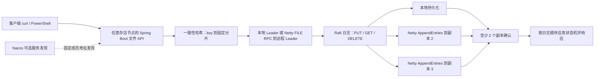

# NexusStore：已实现的最简分布式文件存储

本设计对应 `nexusstore/` 下的 Java 17 / Maven 代码。原 minFS 代码和《技术设计.md》保留作参考。旧 Nexus 设想已存入 `nexusstore/docs/archive/original-design.md`；其中 PD、RocksDB、动态分片和性能数字不是本实现的成果。

## 1. 目标与范围

做一个能亲自运行、能讲透、能通过故障实验验证的小文件存储原型。核心是文件操作、Netty 异步通信、一致性哈希与手写 Raft；订单、Redis 限流、MySQL 缓存不在范围内。

| 简历技术点 | 实际落地 |
|---|---|
| Spring Cloud + Nacos | Spring Cloud Alibaba DiscoveryClient；可选 Nacos 注册、健康实例发现；Netty 地址通过 metadata 暴露 |
| 服务健康与故障转移 | Actuator 本地健康；Raft 独立心跳和选举；文件入口重试当前 Leader |
| Netty 异步通信 | 长连接、长度帧、请求编号与 future 匹配、超时清理、断连处理、流量及帧大小限制 |
| 一致性哈希 | SHA-256 + 每分片 64 个虚拟节点，key → s0..s3 |
| Raft 一致性 | 固定三成员，随机选举、投票持久化、日志匹配、冲突修复、多数派提交、重启回放 |
| CP | 读写均经多数派提交；少数派不返回成功或陈旧文件 |

“高性能”是研究方向，不是已取得的压测结论。本实现为了可读性牺牲吞吐，不能沿用旧文档里的 QPS、P99 或倍数提升。

## 2. 架构



三个进程运行同一份 `nexus-server` JAR，每个进程承载默认四个 RaftGroup。HTTP 是便于演示的接入层，节点间文件转发和 Raft 消息走 Netty。没有独立 PD、网关或 SDK，也没有大文件数据面与元数据面的分离。

| 模块 | 职责 |
|---|---|
| nexus-common | JSON 编解码、Netty RPC、稳定哈希环 |
| nexus-raft | 不依赖 Spring/Netty 的共识实现；transport 可被测试网络替换 |
| nexus-server | 多分片、HTTP 文件 API、Leader 路由、Nacos 集成、本机配置验证 |

## 3. 文件与分片

API 为 `PUT/GET/DELETE /api/files?key=...`。value 是不超过 1 MiB 的原始字节，允许空文件；PUT 整体覆盖，DELETE 删除逻辑 key。key 最多 512 UTF-8 字节，不会转成本地路径。目录、append、文件流、断点续传、跨文件事务未实现。

哈希环放置固定逻辑分片。三个节点使用完全相同的算法和配置；文件 key 映射到一个分片，其完整内容作为一条命令复制。

**所有分片都有三个相同物理成员，因此每台机器持有全部文件。** 分片提供独立日志、独立选主和并行处理；不增加有效容量，也不保证 Leader 平均分布。健康变化不会重建环，故障不会让已写入 key 被映射到空分片。

`topology.json` 绑定 nodeId、成员地址、分片数和虚拟节点数；重启修改它们会被拒绝，因为当前没有迁移协议。节点及分片持有本地文件锁，避免两个进程同时使用同一目录。

## 4. Netty 协议

```text
4 字节大端 JSON 长度 | JSON 正文（最大 8 MiB）
请求：id, method(VOTE/APPEND/FILE), group, body
响应：id, success, body, error, leaderId
```

LengthFieldBasedFrameDecoder/LengthFieldPrepender 处理 TCP 半包粘包；JSON 的 byte[] 使用 base64。每个地址缓存一条长连接，按请求编号匹配 CompletableFuture；断连、超时、发送失败清理 pending，后续重连。帧大小、并发请求和写缓冲有上限，超载拒绝。

Boss 接收连接，EventLoop 处理网络事件。共识状态和磁盘写入在每个分片自己的单线程执行器中处理，通过异步回调衔接；没有在 EventLoop 中等待 Raft 提交。JSON 编解码有 CPU 和复制成本，此版本没有零拷贝。

## 5. 手写 Raft

### 选举

心跳默认 120ms，随机选举超时 600–1000ms。Follower 超时后 term 增加，持久化 term 与自己的投票，再发 RequestVote。判断候选人的 `(lastLogTerm,lastLogIndex)` 是否至少与本地一样新，同一 term 只投一个候选人；三节点拿到两票成为 Leader。

高 term 消息使节点退回 Follower；term/vote 持久化后再响应。新 Leader 追加 NOOP，建立当前任期提交点。没有 PreVote，分区恢复时孤立节点的较高 term 可能造成额外选举。

### 日志复制

Leader 先持久化命令，再并行发送 AppendEntries。Follower 检查 prevLogIndex/prevLogTerm；不匹配时返回冲突位置，Leader 回退 nextIndex。相同位置遇到不同 term 时截断未提交尾部，追加新日志；不会覆盖已提交日志。

Follower 落盘后才能确认。Leader 按 matchIndex 计算多数派复制位置，**只通过计数直接提交当前 term 的日志**，之前 term 的前缀随之提交。持久化 commitIndex，按顺序 apply，再完成客户端 future。分批复制时 Follower 的 commitIndex 还受本次已匹配位置限制，不能提交未验证的旧尾部。

### 线性一致读

GET 也是日志命令，提交后在该日志位置读取状态机。旧 Leader 与多数派隔离后不能提交新 GET，因此不返回陈旧值。代价是每次读都复制并写日志；没有 ReadIndex 或 Lease Read，后续应优先实现 ReadIndex。

### 幂等与超时

PUT/DELETE 带 requestId，状态机记录首次应用的命令和结果。相同 ID 与相同命令返回原始结果，不重复执行；ID 与不同命令冲突报错。重启回放恢复幂等记录。重复写仍经过新的提交确认，不给孤立 Leader 留绕过多数派的成功捷径。

Raft 提交默认等待 2.5s，入口有独立 9s 总期限，在此期间尝试 Leader 提示和固定成员。503 只表示没有拿到确认，不保证写入未生效；客户端应预先保存 UUID，重试同一个 ID 和内容。GET 不复用旧查询结果。

## 6. 持久化与限制

```text
data/node1/
  topology.json
  node.lock
  s0/raft-state.json
  s0/raft.lock
  s1/... s2/... s3/...
```

每个 raft-state.json 的格式 2 保存身份、成员表、term、votedFor、commitIndex、快照和保留日志尾部。流式写临时文件、FileChannel.force(true)、原子替换；快照与尾部在同一次替换中持久化。启动验证后加载快照并回放到 commitIndex。旧格式 1 的完整日志可直接读取并升级，新旧程序不支持混合滚动运行。

状态机用内存 Map 保存文件。默认累计应用 128 条日志或 4 MiB 后自动快照，快照保存当前文件和 mutation 指纹/首次结果，压缩已应用前缀；未提交尾部保留，绝对日志索引继续递增。旧覆写文件字节不保留在去重记录中。

Follower 落后到其 nextIndex 已被压缩时，Leader 使用 InstallSnapshot，每块最多 256 KiB。最终 SHA-256/身份/边界校验及原子落盘后才确认安装；重传、offset 校验和旧快照防回退均在协议中处理。匹配快照边界才保留本地后缀。`POST /api/admin/compact` 可触发本地各分片独立压缩，`/api/cluster` 展示快照边界和保留日志统计。

每组保留日志仍有 64 MiB / 20,000 条上限，未提交数据不能靠压缩释放；快照内当前文件与永久去重记录有 64 MiB 编码上限、各自 100,000 条记录上限。快照不清除去重记录，不提供无限容量；达到状态上限会拒绝增加状态的新写请求。内存索引、接收缓冲、发送中的快照及序列化仍有额外堆开销。详见 `nexusstore/docs/snapshots.md`。

承诺范围是进程崩溃和重启。Windows 下未对父目录 fsync，不能声称覆盖整机断电、磁盘撒谎和所有介质故障。快照有 SHA-256 校验，但保留日志及外层 JSON 还没有完整数据校验机制。持久化失败会 fail closed，不再确认成功。

## 7. Nacos 与故障发现

默认只使用固定地址，方便没有 Docker/Nacos 的机器运行。启用 nacos profile 后三个实例注册为 nexus-store、group=NEXUS_DEMO，metadata 带 node-id/netty-port；DiscoveryClient 每 5s 获取健康实例，展示在 `/api/cluster.discoveredPeers`。

只接受与固定拓扑匹配的发现地址；注册中心不可用仍有 seed 地址。Raft 自己感知 peer 不可达并选主。**服务发现、Raft 成员关系、Leader 选举是三件不同的事。** Nacos 移除实例不等于安全移除 Raft 成员。

Actuator 反映本地进程/分片是否失败，不是集群多数派证明。单节点存活时可以仍显示 UP，而文件读写返回 503。

## 8. 验证与演示

运行方法见 `nexusstore/README.md`。协议测试控制传输网络验证投票、旧任期提交限制、日志冲突、分区与重启；集成测试使用真实 Netty 连接；PowerShell 再通过 HTTP 实际停进程验证端到端行为。

| 故障 | 预期 |
|---|---|
| 一个 Follower 停止 | 两节点多数派仍可提交 |
| Leader 停止 | 重新选主；确认写入不丢 |
| 只剩一个节点 | 文件读写都不能确认成功 |
| 旧 Leader 隔离 | 旧 Leader 新读写超时；多数派继续工作 |
| 网络恢复 | 冲突未提交尾部被替换，追平已提交前缀 |
| 三节点全部重启 | 回放数据并重新选主 |
| 落后副本所需日志已压缩 | 安装分块快照，再追剩余日志 |
| 压缩后重试旧写请求 | 使用快照中的指纹/原始结果，不再次覆盖新内容 |
| 同一写请求重试 | 返回原始应用结果，不再次覆盖/删除 |

这些测试不能代替形式化证明、Jepsen 或生产故障验证。没有编造生产部署经历和性能成果。

## 9. 后续演进

先理解现有状态转移和快照，再按需要增加 WAL 分段、异步快照生成、ReadIndex、大文件块与清单、成员变更、分片迁移；之后才考虑 PD、MySQL、Redis、RocksDB。每一步配故障测试与真实测量。

协议依据：[Raft 论文](https://raft.github.io/raft.pdf)。框架参考：[Spring Cloud Alibaba 官方仓库](https://github.com/alibaba/spring-cloud-alibaba)、[Spring Boot 3.2.12 文档](https://docs.spring.io/spring-boot/docs/3.2.12/reference/htmlsingle/)。依赖版本固定在 POM，兼容性以构建与运行验证为准。
