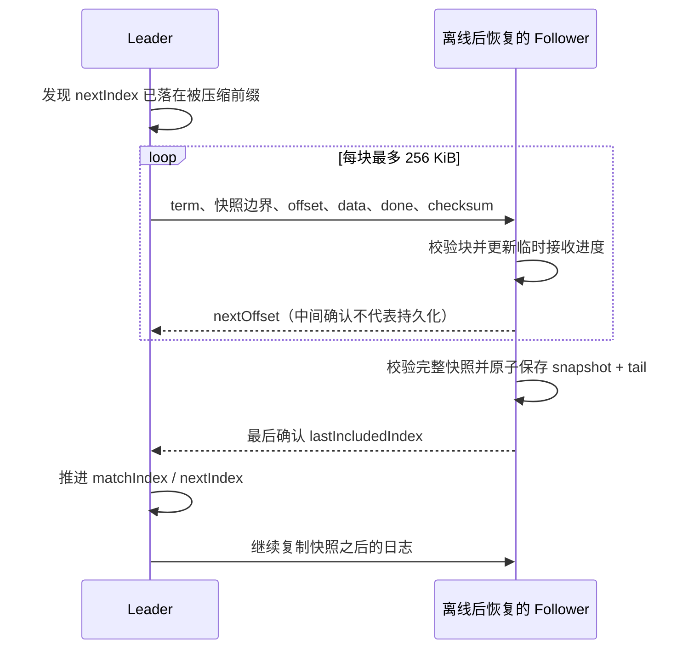

# 用快照替换已经应用的日志前缀

第一版每次都保存完整 Raft 历史，连 GET 也记日志。累计操作达到日志条数/大小上限后，演示就不能继续。本版把已经执行完的历史替换成当前状态，支持自动压缩、重启恢复以及向落后副本发送快照。

## 一个例子

假设日志 1..100 已提交并应用，101..103 仍未提交：

| 项目 | 压缩前 | 压缩后 |
|---|---|---|
| 快照边界 | 0 | index=100，term=第 100 条日志的任期 |
| 保留日志 | 1..103 | 101..103 |
| commitIndex / lastApplied | 100 / 100 | 100 / 100 |
| lastLogIndex | 103 | 103 |
| 下一条日志 | 104 | 104 |

快照只能覆盖 lastApplied 之前的已执行命令。没有提交的 101..103 仍需 Raft 决定保留或覆盖，不能因为磁盘满而直接删除。第 101 条日志的 prevLogTerm 从快照边界取得，不能把数组下标当作日志索引。

## 快照保存什么

- 分片 ID、固定成员表、lastIncludedIndex 和 lastIncludedTerm。
- 当前文件 key → bytes，已经被覆盖/删除的旧内容不保留。
- mutation requestId → SHA-256 命令指纹、第一次执行的 found/index 结果。

仅保留文件内容是不够的。例如请求 A 写入 v1、请求 B 覆盖为 v2，压缩后重试 A 仍必须返回 A 的原结果，不能重新把文件覆盖回 v1。去重表保存指纹而不是完整旧 PUT 内容，因此不需要为了幂等继续持有所有历史文件字节。

SnapshotCodec 用明确长度字段的二进制格式编码，并按 key/requestId 排序保证确定性。校验 SHA-256 用于识别传输或快照字节损坏，不是身份认证。接收方同时验证分片、成员、边界和字段长度。

## 本地持久化

`raft-state.json` 的格式 2 包含 term、vote、commitIndex、snapshot、保留的 log tail。二进制快照在外层 JSON 中编码为 base64；整个状态文件使用流式 JSON 写入临时文件、force、原子替换。

快照与日志尾部在同一次原子替换中发布，不需要协调两个文件的提交顺序。进程在替换前退出就读取旧完整状态，替换后退出就读取新快照和尾部；内存状态从快照开始恢复，再回放至 commitIndex。磁盘格式 1 没有 snapshot 字段，读取后按旧完整日志回放，后续持久化升级为格式 2。

原来的进程崩溃恢复边界不变：本地没有对父目录 fsync，不宣称覆盖整机掉电。读取到损坏快照时停止启动，不能悄悄当作空节点。

## 落后副本的 InstallSnapshot

每个副本一次传输一个不可变快照；期间 Leader 可以生成更新快照，旧传输仍完成既定版本。丢失响应时可重发相同块，重复块必须字节一致；跳过 offset 会被拒绝并返回当前接收位置。接收进程重启后临时内存丢失，要求从 offset 0 重传。

Follower 不会安装比本地 commitIndex 更旧的状态。如果本地日志在快照边界具有相同 index/term，只保留边界之后的尾部；边界不匹配则丢弃冲突未提交尾部。只有最后校验并落盘完成，Leader 才能把快照位置计入该副本的 matchIndex。

## 自动阈值与资源边界

| JVM 系统属性 | 默认值 | 含义 |
|---|---:|---|
| `nexus.raft.snapshotEntries` | 128 | 自上次快照起已应用的日志条数 |
| `nexus.raft.snapshotLogBytes` | 4 MiB | 已应用日志的估算字节数 |
| `nexus.raft.maxLogEntries` | 20,000 | 保留的日志条数上限 |
| `nexus.raft.maxLogBytes` | 64 MiB | 保留日志估算大小上限 |
| `nexus.raft.maxSnapshotBytes` | 64 MiB | 单分片整个快照的编码大小上限；不能配置更大 |
| `nexus.raft.maxStateEntries` | 100,000 | 文件条目和永久写请求去重条目各自的数量上限 |

这些是 `java -D属性名=值 -jar ...` 参数，不是 Spring 的 `--nexus...` 参数。三个成员应使用相同限制。自动阈值较大但保留日志接近容量时，也会尝试释放已应用前缀。

快照不会删除永久 requestId 历史。去重数量满后，新 DELETE 也需要新记录，因此会被拒绝；GET 和已知 ID 的相同请求仍可使用。追加前预演已应用状态、未提交尾部和新请求的资源占用，避免并发写各自以为拥有同一份剩余容量。

快照制作、最终安装和持久化仍在分片执行线程进行，会增加延迟；活动值、去重对象、接收缓冲、发送中的旧快照及 JSON 编码均消耗堆内存。64 MiB 是单分片编码限制，不是整个进程内存预算，更不是吞吐承诺。

## 面试演示判据

运行 `scripts/snapshot-test.ps1`。先观察 snapshotIndex 前进、retainedLogEntries 减少，再观察恢复副本自身的 snapshotIndex 和 lastApplied。仅从恢复节点的 HTTP 接口读到文件不够，因为请求可能转发到 Leader。

最后停止快照发送者，让恢复副本参与剩余两节点多数派，再验证文件哈希，才能把“文件还在”和“恢复副本确实能参与共识”连起来解释。

算法参考：[Raft 论文第 7 节与 Figure 13](https://raft.github.io/raft.pdf)。实现仍限固定三节点；快照不包含在线成员变更、动态分片迁移或跨分片事务。
